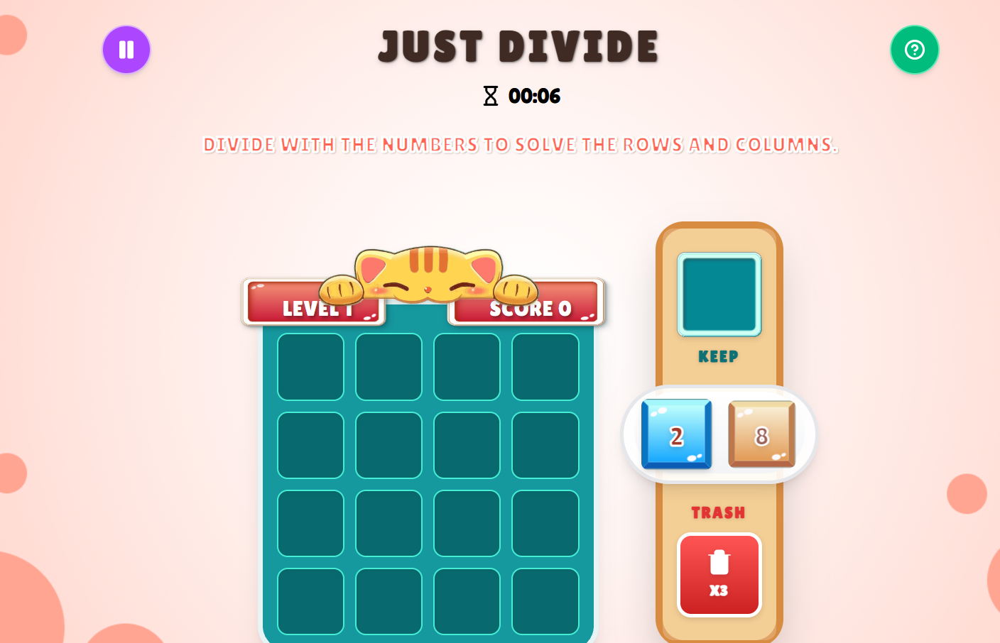

# Just Divide - Kid Math Puzzle 🐱➗



Welcome to **Just Divide**! An intuitive, drag-and-drop math puzzle game designed to sharpen division skills in a fun, relaxing, and highly interactive environment. Help your cartoon cat buddy solve the board!

🌟 **Play it live here:** [Just Divide on Vercel](https://kid-math-puzzle.vercel.app)

---

## 🎮 How to Play

The objective of the game is to clear tiles from the board using simple division rules.

1. **Drag and Drop:** Pick up numbers from the Queue and drop them into the empty slots on the 4x4 grid.
2. **Divide to Conquer:** If you place a tile adjacent to a grid number that it divides into evenly (e.g., dropping a `2` next to an `8`), they will merge together and reward you with the quotient (`4`).
3. **Match to Clear:** If you place a tile next to an identical number, they both pop and clear from the board!
4. **Use Your Tools:**
   - **Keep Slot:** Need a tile for later? Drop it in the Keep slot to stash it.
   - **Trash:** Stuck with a bad number? Throw it in the trash perfectly (be careful, you only have limited uses!).
5. **Level Up:** Score big to advance to the next level—higher levels refill your trash allowances to keep the game going!

---

## 🚀 Features

- **Kid-Friendly Interface:** Vibrant, cartoonish graphics with an adorable cat companion and smooth, playful animations.
- **Responsive Layout:** Flawlessly transitions between desktop displays and mobile touch screens with a specialized dock.
- **Drag-and-Drop Interaction:** Built with a robust physical drag-and-drop mechanics supporting both mouse and mobile touch pointers.
- **Smart Logic System:** A custom game loop that watches for valid mathematical moves.
- **Timers & Progress:** Built-in play timer, level progression, and high-score persistence!

---

## 🛠️ Technologies Used

This project was built using modern web development standards and optimized for performance:

- **Framework:** [React 18](https://react.dev/) via [Vite](https://vitejs.dev/) for lightning-fast compilation.
- **Styling:** [Tailwind CSS v4](https://tailwindcss.com/) for fully responsive, atomic styling and bespoke utility classes.
- **Animations:** [Framer Motion](https://www.framer.com/motion/) for fluid transitions, physics-based modal pop-ups, and overlay rendering.
- **Drag and Drop:** [@dnd-kit/core](https://dndkit.com/) for reliable and fully customizable grid sensor controls.
- **Icons:** [Lucide React](https://lucide.dev/) for crisp, scalable SVG indicators.

---

## 💻 Running the Game Locally

Want to tinker with the code or run it on your own machine? It's simple:

### Prerequisites
Make sure you have [Node.js](https://nodejs.org/) installed on your machine.

### Setup Instructions

1. **Clone the repository:**
   ```bash
   git clone https://github.com/lucky20T/kid-math-puzzle.git
   cd kid-math-puzzle
   ```

2. **Install the dependencies:**
   ```bash
   npm install
   ```

3. **Start the development server:**
   ```bash
   npm run dev
   ```

4. **Play!**
   Open your browser and navigate to the address shown in your terminal (usually `http://localhost:5175`).

---

### Inspiration
Designed specifically to make mathematical division less intimidating for kids through bright aesthetics, gamification, and engaging interactions.

*Created with ❤️ for learning and playing.*

---

## 🧠 Technical Deep Dive

A full breakdown of every feature, design decision, and implementation detail — useful for code reviews and interviews.

---

### 🏗️ Architecture & State Management

| Feature | Detail |
|---|---|
| **`useReducer` + Context API** | All game state lives in `GameContext.jsx` using `useReducer`. A single `gameReducer` handles all actions (place, trash, keep, undo, pause, restart). No external library needed — clean and predictable. |
| **Custom Hook (`useGameLogic`)** | Abstracts all `dispatch` calls into named functions (`handleMove`, `handleTrash`, `handleUndo`, etc.), so components never call `dispatch` directly. Clean separation of concerns. |
| **`DragOverlay` pattern** | Tracks `activeId` and `activeValue` in local `useState` to render a floating ghost tile while dragging — avoids re-rendering the whole tree on every drag move. |

---

### 🎯 Core Game Mechanics

| Feature | Code Location | Explanation |
|---|---|---|
| **Division merge logic** | `src/utils/mergeLogic.js` | When a tile is placed, it checks all 4 neighbours. If `tile % neighbor === 0`, they divide and produce a quotient. If equal, both clear. Uses a `while (hasMerged)` loop for **chain reactions**. |
| **Game-over detection** | `src/utils/helpers.js → isGameOver()` | Grid is full AND no adjacent pair can merge → game over. Uses `canMerge()` helper that checks divisibility in both directions. |
| **Adjacency logic** | `src/utils/helpers.js → getAdjacentIndices()` | Handles a flat 16-element array as a 4×4 grid using row/col math. Correctly ignores out-of-bound neighbours at grid borders. |
| **Tile generation** | `src/utils/helpers.js → getNextTile()` | Random tile from a curated set `[2,3,4,5,6,8,9,10,12]` — all highly composite numbers to ensure merges are always possible. |
| **Level progression** | `src/context/GameContext.jsx` | Score threshold: `score >= level * 10` → level up + 2 more trash uses rewarded. |
| **`bestScore` persistence** | `src/context/GameContext.jsx` | `localStorage.getItem/setItem` synced via `useEffect` whenever the current score exceeds the stored best. Persists across sessions. |

---

### ↩️ Undo System

| Feature | Detail |
|---|---|
| **Undo Stack (last 10 moves)** | `undoStack` is an array inside state. Every mutating action (`PLACE_TILE`, `USE_TRASH`, `TOGGLE_KEEP`) pushes the full previous state snapshot into `undoStack.slice(-10)`. `UNDO` pops the last snapshot. |
| **Partial state restore** | On undo, `isPaused` and `showRules` are **not** restored — only game data is reverted. Prevents UI modal state from breaking during an undo. |

---

### 🖱️ Drag-and-Drop (`@dnd-kit/core`)

| Feature | Detail |
|---|---|
| **Dual sensor support** | `MouseSensor` (distance: 5px) + `TouchSensor` (delay: 100ms, tolerance: 5px) wired via `useSensors`. Works on both desktop and mobile. |
| **`closestCenter` collision** | Tiles snap to the closest droppable center — prevents misfires on small grid cells. |
| **`DragOverlay` with custom drop animation** | A clone of the tile follows the cursor while dragging (`cubic-bezier` easing, 250ms). The original tile stays in place — standard DnD UX pattern. |
| **Droppable data types** | Drop targets pass `data.current.type` (`grid`, `trash`, `keep`), so `handleDragEnd` routes to the right action without relying on element IDs. |

---

### 🎨 UI/UX & Animations (`Framer Motion`)

| Feature | Detail |
|---|---|
| **Tile enter/exit animations** | `StaticTile` and `DraggableTile` use `initial={{ scale: 0.5, opacity: 0 }}` + spring physics transition — tiles pop into existence naturally. |
| **`layout` prop** | `StaticTile` uses Framer Motion's `layout` prop so positional shifts in the grid are automatically animated when tiles appear or disappear. |
| **Modals** | `GameOverModal`, `RulesModal`, and `PauseOverlay` are rendered inside `DndContext` and mounted/unmounted based on state flags (`showRules`, `isPaused`, `gameOver`). |
| **Responsive layout** | Mobile: tools panel is a horizontal `flex-row` dock at the bottom. Desktop: vertical `flex-col` sidebar. Controlled purely with Tailwind CSS responsive breakpoints (`md:`). |

---

### ⏱️ Timer

| Feature | Detail |
|---|---|
| **Live play timer** | A `useEffect` in `GameContext` starts a `setInterval` ticking every second. Automatically cleans up (`clearInterval`) when the game is paused or over — correct effect cleanup on every dependency change. |

---

### ♟️ Game Tools

| Tool | Behaviour |
|---|---|
| **Keep Slot** | Stashes the current queue tile. On second use, swaps the kept tile back to the front of the queue. Functions like the "hold" mechanic in Tetris. |
| **Trash** | Discards the current tile; limited to `trashCount` uses, replenished on level-up. Prevents infinite discarding. |
| **Pause / Rules** | Opening the Rules modal auto-pauses the game (`TOGGLE_RULES` sets `isPaused: true`). Closing it resumes seamlessly. |

---

### 🧰 Tech Stack Summary

| Layer | Technology |
|---|---|
| Framework | React 19 + Vite 8 |
| Styling | Tailwind CSS v4 |
| Animations | Framer Motion |
| Drag & Drop | @dnd-kit/core |
| State Management | `useReducer` + Context API |
| Persistence | `localStorage` |
| Icons | Lucide React |
| Deployment | Vercel |

---

### 💬 Key Interview Talking Points

1. **"Why `useReducer` instead of multiple `useState` calls?"** → Game has many interdependent state fields (grid, queue, score, level, trash, undo stack). `useReducer` co-locates all mutation logic, making transitions predictable and easy to test.
2. **"How does undo work?"** → Immutable snapshot pattern — each action saves the current state into a bounded stack before mutating. Undo simply restores the last snapshot.
3. **"How did you detect game over?"** → Grid traversal: if no empty cell exists AND no adjacent tile pair satisfies `canMerge()`, the game is deadlocked.
4. **"How did you handle mobile drag-and-drop?"** → `TouchSensor` with a 100ms activation delay and 5px tolerance prevents accidental triggers during scroll.
5. **"What was the hardest part?"** → The **chain merge loop** — after a tile divides into a quotient, that quotient may itself be divisible by another neighbour. The `while (hasMerged)` loop in `mergeLogic.js` re-runs until the board is stable.
